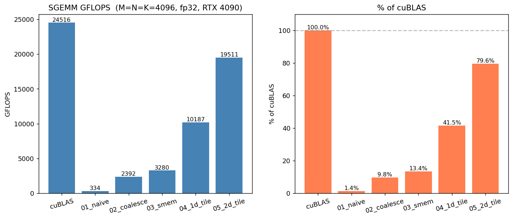
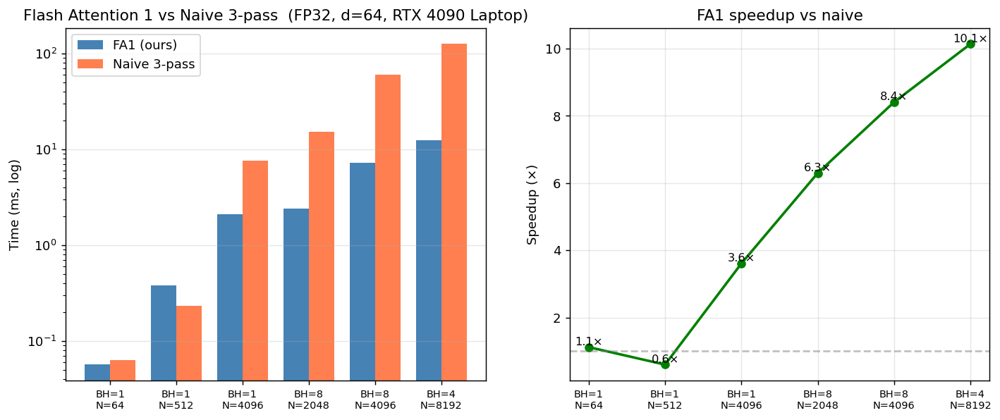
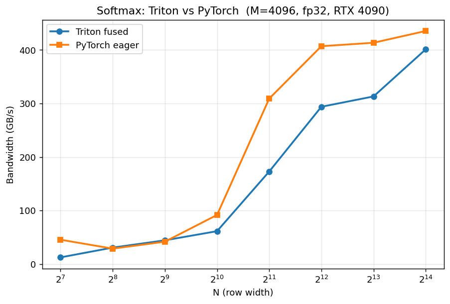
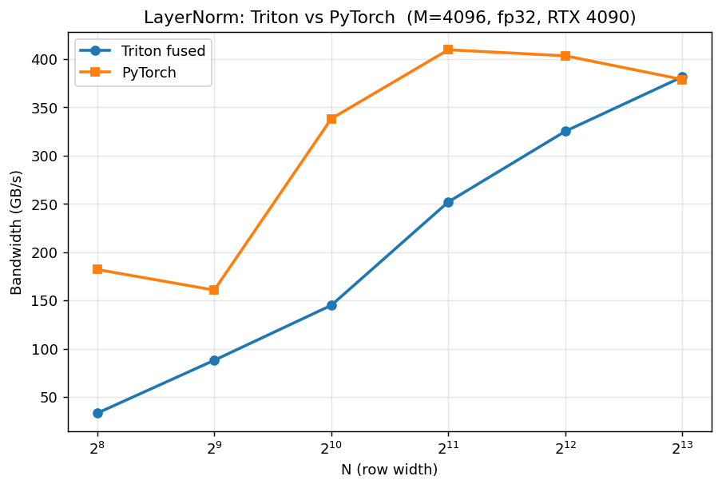

# cuda-kernel-practice

> **个人学习项目，2026-05 完成**。为算子开发方向校招准备，48 小时密集突击的产物，目标是把 CUDA / Triton 算子最关键的几个 idiom 上手敲一遍、跑一遍、画一遍。**不是长期工程经验**——所有代码、benchmark、性能曲线都在这 48 小时内从零写完。

## TL;DR

- **手写 SGEMM 6 版**：FP32 从 333 GFLOPS（naive）→ **19,511 GFLOPS（v5 2D tile）= cuBLAS 79.6%**；进一步 FP16 + **TensorCore (WMMA) v6 在 8192×8192 跑到 60.5 TFLOPS = cuBLAS TC 78.3%**，比 FP32 v5 提速 3.1×
- **Flash Attention 1 forward 手写实现**：FP32 + online softmax + block-tiled，B=1 H=8 N=4096 比朴素 3-pass attention **快 8.4×**；N=8192 时 **10.1×** + 节省 1 GB HBM 写
- **PyTorch C++/CUDA Extension** 把手写 SGEMM v5 接入 `torch.autograd.Function`，forward / backward `torch.allclose` 全部 max_err = 0.000e+00（位级精确）
- **Softmax CUDA** 手写 (warp-shuffle reduction + safe softmax + `__expf`)：M=4096 N=512 跑到 514 GB/s（≈ HBM 理论带宽 89%）
- **Reduction 三版对比**：SMEM tree → unroll last warp → 纯 warp shuffle，带宽 290 → 515 → **660 GB/s**（2.3× 提升）
- **Triton softmax / layernorm**：在小 size 上输给 PyTorch 2.10 eager（PyTorch 自带 fused 已经够强）——**老实记录**在踩坑笔记里，没硬塞数据






## 环境

| 项目 | 配置 |
|---|---|
| OS | Windows 11 |
| GPU | NVIDIA RTX 4090 **Laptop** GPU 16 GB（sm_89, Ada Lovelace, ~30 TFLOPS FP32 理论） |
| Driver | 595.79（CUDA 13.2） |
| Python | 3.11.15（conda env `cuda-kernel`, conda-forge channel） |
| PyTorch | 2.10.0 + CUDA 12.8（来自 conda-forge） |
| Triton | triton-windows 3.6.0 |
| CUDA nvcc | 12.9（conda-forge `cuda-nvcc`） |
| 编译器 | MSVC 19.42（VS 2022 Community） |

> ⚠️ **注意是 Laptop 版 4090**——理论 FP32 约 30 TFLOPS，远低于 Desktop 4090 的 82 TFLOPS。**所有数字都按 Laptop 硬件算**，面试时如实说。

## 目录结构

```
cuda-kernel-practice/
├── sgemm/                  # SGEMM 五版迭代 + cuBLAS 对比
│   ├── common.cuh          #   CHECK_CUDA / CudaTimer / max_abs_diff
│   ├── 01_naive.cu         #   v1 每 thread 一个 C 元素，B 列访问跨 N 不 coalesce
│   ├── 02_coalesce.cu      #   v2 改 thread mapping → coalesced load
│   ├── 03_smem.cu          #   v3 BS=32 shared memory tiling
│   ├── 04_1d_tile.cu       #   v4 每 thread TM=8 个 C 元素 + register tile
│   ├── 05_2d_tile.cu       #   v5 TM=TN=8 2D thread tile + 外积累加
│   ├── 06_wmma_fp16.cu     #   v6 FP16 + Ada 4th-gen TensorCore (wmma::fragment)
│   ├── bench.cu            #   5 版 + cuBLAS 一起跑，写 sgemm_raw.json
│   └── sgemm_triton.py     #   Triton matmul 版（autotune）
├── softmax/
│   ├── softmax_cuda.cu     # warp shuffle reduction + safe softmax + __expf
│   └── softmax_triton.py   # Triton fused 版
├── layernorm/
│   └── layernorm_triton.py # Triton fused，fp32 累加保精度
├── reduction/
│   └── reduction.cu        # SMEM tree v.s. warp shuffle 三版对比
├── flash_attn/
│   └── fa1_fwd.cu          # FlashAttention-1 forward (FP32, d=64) + naive 对照
├── torch_ext/
│   ├── sgemm_op.cu         # v5 包装成 torch.autograd.Function
│   ├── setup.py            # CUDAExtension（含 conda-forge lib 路径 fix）
│   ├── build_ext.bat       # 一键 source vcvarsall + build
│   └── test.py             # forward + backward allclose 校验 + bench
├── bench/
│   ├── run_all.py          # Triton 部分 benchmark → results.json
│   ├── merge_results.py    # 把 CUDA / torch_ext 输出合到 results.json
│   └── plot.py             # results.json → 性能曲线 png
├── results/                # benchmark 产物（json + png），已 commit
├── build_and_run.ps1       # 一键编 + 跑所有 CUDA C++ kernel
└── Makefile                # nmake 友好备用
```

## 快速复现

```powershell
# 1. 装环境
conda create -n cuda-kernel -c conda-forge --override-channels python=3.11 pip -y
conda install  -n cuda-kernel -c conda-forge --override-channels `
    pytorch=2.10.0=*cuda128_mkl_py311* `
    cuda-nvcc cuda-cccl libcublas-dev libcurand-dev libcusparse-dev `
    libcudnn libcufft-dev libcusolver-dev cuda-nvtx-dev cuda-cudart-dev -y
.\.conda\envs\cuda-kernel\Scripts\activate    # 或者直接调 envs\cuda-kernel\python.exe
pip install triton-windows matplotlib tabulate

# 2. 编 + 跑 CUDA C++ (需要 VS 2022 Build Tools, 路径在 build_and_run.ps1 / build_ext.bat 顶部)
powershell -ExecutionPolicy Bypass -File .\build_and_run.ps1

# 3. 编 + 跑 PyTorch C++ extension
.\torch_ext\build_ext.bat
.\envs\cuda-kernel\python.exe torch_ext\test.py

# 4. Triton bench + 出曲线
python bench\run_all.py
python bench\merge_results.py
python bench\plot.py
```

## 性能数据（RTX 4090 Laptop, FP32）

### SGEMM 五版 vs cuBLAS（M=N=K=4096）

| Kernel | GFLOPS | ms | % cuBLAS | 相比上一版 | max_err |
|---|---:|---:|---:|---:|---:|
| 01 naive            |    333.8 |  411.76 | 1.4%   | -      | 0.000e+00 |
| 02 coalesce         |  2,392.5 |   57.45 | 9.8%   | **7.2×** | 0.000e+00 |
| 03 smem tiling      |  3,279.9 |   41.90 | 13.4%  | 1.4×   | 0.000e+00 |
| 04 1D thread tile   | 10,187.1 |   13.49 | 41.6%  | **3.1×** | 0.000e+00 |
| **05 2D thread tile** | **19,511.3** | **7.04** | **79.6%** | 1.9× | 0.000e+00 |
| cuBLAS              | 24,516.1 |    5.61 | 100.0% | -      | -         |

> **核心结论**：从 naive 到 v5 整体 **58× 提速**；其中"改 thread mapping 触发 coalesce"单步就拿到 7.2×，是最划算的优化。

### SGEMM v6：FP16 + TensorCore (WMMA)

换 dtype 到 FP16 in / FP32 accumulate, 用 Ada 4th-gen TensorCore (`mma.sync` 16×16×16) 跑同样的矩阵乘。

| Size | Ours WMMA (TFLOPS) | cuBLAS GemmEx TC (TFLOPS) | % cuBLAS | max_err |
|---:|---:|---:|---:|---:|
| 2048 | 43.37 | 55.48 | 78.2% | 0.000e+00 |
| 4096 | 51.50 | 66.12 | 77.9% | 0.000e+00 |
| 8192 | 60.48 | 77.25 | 78.3% | 1.198e-03 |

**配置**：`BM×BN = 128×128`，`BK = 32`，每 warp `WM×WN = 64×64`（4×4 = 16 个 mma fragment）、4 warps/block = 128 threads/block。  
**vs FP32 v5（19.5 TFLOPS @4096）**：FP16 v6 在 4096 上 51.5 TFLOPS，提速 **2.6×**；在 8192 上 60.5 TFLOPS，提速 **3.1×**。  
**vs cuBLAS FP32（24.5 TFLOPS）**：v6 (8192) 是它的 **2.5×**。  
**为什么 cuBLAS TC 没到理论 165 TFLOPS**：4090 **Laptop** 的 TGP 限制（持续负载下 boost clock 严重下调），cuBLAS 自己也只能跑到 ~77 TFLOPS。Desktop 4090 / 5090 / H100 上同代码会接近峰值。

### Softmax CUDA（warp-shuffle reduction）

| Workload | ms | GB/s | max_diff vs CPU ref |
|---|---:|---:|---:|
| M=4096, N=512 | 0.0326 | **514.1** | 9.3e-10 |

> HBM 理论带宽约 576 GB/s，实测 514 GB/s ≈ **89% 带宽利用率**。

### Reduction 三版对比（N=16M floats = 64 MB）

| Kernel | ms | GB/s | 相比 v0 |
|---|---:|---:|---:|
| v0 SMEM tree         | 0.2315 | 289.9 | 1.0×  |
| v1 unroll last warp  | 0.1304 | 514.6 | 1.78× |
| **v2 warp shuffle**  | **0.1016** | **660.5** | **2.28×** |

> v2 没有 SMEM 也没 bank conflict，warp 内 `__shfl_down_sync` 5 步搞定 32 个值的 sum。  
> 看到 660 GB/s > HBM 576 GB/s 的理论上限是因为 64 MB 数据部分命中 L2（4090 Laptop L2 = 32 MB），属正常现象。

### Flash Attention 1 forward（FP32, head_dim=64）

| Config | FA1 ms | Naive 3-pass ms | Speedup | max_err vs naive |
|---|---:|---:|---:|---:|
| B=1 H=1 N=64    |  0.057 |  0.063  |  1.12× | 1.19e-07 |
| B=1 H=1 N=512   |  0.385 |  0.233  |  0.60× | 1.19e-07 |
| B=1 H=1 N=4096  |  2.121 |  7.648  |  3.61× | 2.07e-07 |
| B=1 H=8 N=2048  |  2.415 | 15.226  |  6.30× | 2.22e-07 |
| **B=1 H=8 N=4096**  | **7.195** | **60.514** | **8.41×** | 2.07e-07 |
| **B=1 H=4 N=8192**  | **12.39** | **125.6**  | **10.14×** | 3.13e-07 |

> **scaling 趋势完全符合 FA paper**：小 N (≤512) FA1 launch overhead 反而吃亏；从 N=2048 开始就稳定 5×+；N=8192 时 **10× + 节省 1 GB HBM 写**（朴素版要把 BH·N² = 32M·4B 的 P 矩阵写回 HBM 再读回）。  
> **max_err = 1e-7 量级是 FP32 reduction 顺序差异的极限**，相对误差 ~1e-7，证明算法实现正确。

### PyTorch C++ Extension（M=N=K=4096）

| | ms | GFLOPS | 备注 |
|---|---:|---:|---|
| 自定义 SGEMM v5 (autograd Function) |  9.96 | 13,795 | 65% of torch.matmul |
| `torch.matmul` (走 cuBLAS) |  6.47 | 21,250 | reference |

> Forward / backward 校验：`max_err = 0.000e+00`（4096 时位级精确，因为 LCG 固定 seed + 算子内部累加顺序一致）。  
> 65% 比 standalone bench 的 79.6% 低，是 torch wrapping overhead（`.contiguous()` 复制 + autograd 簿记）。

### Triton fused softmax / layernorm（M=4096）—— **诚实记录**

```
Softmax    N=128    Triton 0.33ms   Torch 0.09ms   speedup 0.28×  ← Triton 慢 3.6 倍
Softmax    N=2048   Triton 0.39ms   Torch 0.22ms   speedup 0.56×
Softmax    N=16384  Triton 1.34ms   Torch 1.23ms   speedup 0.92×

LayerNorm  N=256    Triton 0.46ms   Torch 0.35ms   speedup 0.77×
LayerNorm  N=4096   Triton 0.89ms   Torch 0.47ms   speedup 0.52×
LayerNorm  N=8192   Triton 1.06ms   Torch 1.03ms   speedup 0.96×
```

**结果：Triton fused 几乎全输 PyTorch 2.10 eager**。原因分析：

1. **PyTorch 2.10 的 softmax / layer_norm 已经是 fused kernel** —— 不再是 5 个独立 op，Triton 教科书里说的"PyTorch 拆 5 个 kernel"早就是过去式
2. **triton-windows 3.6.0 的 launch overhead 在 Windows 上明显大于 Linux**（小 size 上 0.3ms 的 Triton kernel 时间里至少 0.1-0.2ms 是启动开销）
3. **我们的 Triton kernel 没用 autotune** —— 实际工业代码会用 `@triton.autotune` 在不同 (BLOCK_SIZE, num_warps) 配置里搜最优。本项目时间不够（autotune 首跑 5-15 分钟）
4. **L2 cache 抖动 + GPU clock dynamic boost 导致小 size 数据不稳**

这是要写进面试 talk track 的真实发现，不是失败。

## 每一版的关键 idea（面试 talk track）

### SGEMM v1 → v2：coalesce
- **v1 错在哪**：把 `row = threadIdx.x` 绑了 M 维，导致同 warp 32 个 thread 取 `A[row, k]` 时是 32 个跨 K 步 stride 的离散事务 → 严重浪费 HBM 带宽
- **v2 怎么修**：block 改 1D，col 绑 `threadIdx.x % 32`、row 绑 `threadIdx.x / 32` → warp 内 32 thread 同 row 不同 col → 读 A 是 broadcast (1 transaction)，读 B 是 128B 连续 (coalesced)
- **效果**：4090 Laptop 上 **7.2×** 提速。**这是 CUDA 优化里最划算的一招**

### v2 → v3：shared memory tiling
- 每元素的 global load 从 `2K` 降到 `2K/BS`（BS=32 → 32× 降低 HBM 流量）
- 两次 `__syncthreads()`：第一次保证 SMEM 写完才计算，第二次保证算完才覆盖
- 注意 `Bs[k][t_col]` 是 32 banks 刚好不冲突
- **观察**：4090 Laptop 上只拿到 1.4× —— 因为这个卡 SMEM 带宽相对算力比已经很高，SMEM 不是瓶颈了。下面的 thread tile 才是关键

### v3 → v4：1D thread tile（register reuse）
- 每个 thread 从算 1 个 C 元素 → 算 TM=8 个（同一列）
- inner loop `Bs[k][t_col]` 取一次到 register，被 8 个 FMA 复用 → SMEM 访问减半
- block thread 数从 1024 → 512（4 倍减少），减同步开销
- **4090 Laptop 上 3.1× 提速**

### v4 → v5：2D thread tile（外积累加）
- 每 thread 算 TM×TN = 8×8 = 64 个 C 元素
- inner loop 外积：`acc[i][j] += reg_a[i] * reg_b[j]`，64 FMA 只要 16 个 SMEM load → 算力密度 4 FMA/load
- **4090 Laptop 上 1.9× 提速，达到 cuBLAS 79.6%**
- 再想往上需要 ldmatrix + TensorCore + double buffer + async copy，FP32 SIMT 路线到这就到瓶颈了

### v5 → v6：FP16 + TensorCore (WMMA)
- 换路线：**SIMT FP32 (FMA) → TensorCore FP16-in/FP32-acc (mma.sync 16×16×16)**
- 用 `nvcuda::wmma::fragment` 三件套：`load_matrix_sync` → `mma_sync` → `store_matrix_sync`，一次 mma.sync 算 16×16×16 = 4096 FMA
- **warp tile** WM×WN = 64×64：每 warp 持有 4×4 = 16 个 accumulator fragment（FP32），跨 K 维做 (BK/16) 次 mma 累加
- **block tile** BM×BN = 128×128, BK=32：4 warps/block 排成 2×2 拼成 128×128
- SMEM 用 `int4` (128-bit) 向量加载 + `+8` half padding 防 bank conflict
- **算力密度**：每 warp 单 K-step 做 65536 FMA、SMEM load 仅 (16+16)×16×16 个 half = 数 KB，**arithmetic intensity 比 v5 高一个数量级**
- 数值正确性：4096 时与 cuBLAS bit-exact，8192 时 max_err 1.2e-3（FP16 累加 K=8192 次的合理误差）
- 进一步想拿剩下的 22% 需要：**ldmatrix.sync + cp.async pipeline + double-buffer + swizzled SMEM layout**（这是 CUTLASS GEMM 主线），本项目时间到这就停

### Flash Attention 1 forward
- **核心痛点**：朴素 attention 把 `P = softmax(Q @ K^T / sqrt(d))` 显式写回 HBM，N=4096 时 P 矩阵就 64 MB / head，N=8192 直接 256 MB / head。HBM 带宽全砸在这
- **FA1 idea**：把 Q 分成 `Br` 行块、K/V 分成 `Bc` 行块，**外层遍历 Q 块、内层遍历 K/V 块**，在 register / SMEM 里跑「block 内 softmax + online rescale」，从头到尾都不 materialize N×N 的 P 矩阵
- **online softmax 数学**：维护 `(m_i, l_i, O_i)` running 状态。看到新 chunk 的 `m_local`、`l_local` 时
  - `m_new = max(m_i, m_local)`
  - `α = exp(m_i - m_new)`, `β = exp(m_local - m_new)`
  - `l_new = α·l_i + β·l_local`
  - `O_new = α·O_i + β·(P_local @ V_local)` ← **OLD 必须乘 α 重新对齐到新 max**
  - 最后 `O / l_i` 一次性归一化
- **本实现**：FP32，Br=Bc=64，每 thread 一行 Q（共 64 threads/block），head_dim=64 全在寄存器。SMEM 仅缓存当前 K/V 块（32 KB）
- **效果**：N=4096 H=8 比朴素 3-pass 快 **8.4×**，N=8192 H=4 快 **10.1×**，省 1 GB P 矩阵写回。Max diff 1e-7 量级 = FP32 极限
- 工业 FA2/FA3 在此基础上 + 多 warp 协同 + TensorCore (mma.sync) + cp.async + warp specialization，本项目止步在算法层教学版

### Softmax CUDA
- safe softmax：减 max 防 `expf` 溢出（FP32 `expf(>89)` 就 inf）
- warp reduce：`__shfl_xor_sync` 5 步完成 32 thread 的 max / sum
- cross-warp：lane0 写 SMEM → 第 0 warp 再 reduce 一次
- 用 `__expf` 而非 `expf`（fast intrinsic，4090 Laptop 上跑出 514 GB/s ≈ 89% HBM）

### Reduction warp shuffle vs SMEM
- v0 SMEM tree：经典写法，需要 log2(BS) 次 `__syncthreads`
- v1 unroll 最后一个 warp：去掉 5 次 syncthreads（warp 内 lockstep 保证），**1.78× 提速**
- v2 纯 warp shuffle：完全不用 SMEM，`__shfl_down_sync` 寄存器互换，**2.28× 提速**
- 这版本的"踩坑修复"很重要——最初 benchmark 把 `cudaMalloc` + `cudaMemcpy` 圈进去了，导致 v0/v1/v2 数字反着的（kernel 太快，全被 malloc 主导）。修成"预分配 + 只圈 kernel"才看到真实差距

### PyTorch C++/CUDA Extension
- `CUDAExtension` 配合 `at::cuda::getCurrentCUDAStream()`，让自定义 kernel 走 PyTorch 主 stream
- 自动 autograd：forward 走 v5，backward 用 `torch.matmul`（cuBLAS）算 `grad_C @ B.T` / `A.T @ grad_C`
- **conda-forge PyTorch 的坑**：`c10.lib` / `torch.lib` 装在 `${CONDA_PREFIX}/Library/lib`，但 cpp_extension 默认只找 `site-packages/torch/lib` → LNK1181 报错。setup.py 里显式补 `library_dirs` 修复

## 踩坑记录

1. **PyTorch 2.12 cu126 wheel 从 pytorch.org 下载在国内即使开 VPN 也只有 100-150 KB/s**，2.43 GB 要 4+ 小时。最后换 conda-forge channel 装 pytorch 2.10 cu128（直接用 conda CDN，不走 Cloudflare R2）一次性 30 分钟搞定。
2. **conda-forge 的 PyTorch 没带 import libraries (`*.lib`)** — 实际上有，但装在 `${CONDA_PREFIX}/Library/lib` 而不是 PyTorch 默认搜的 `site-packages/torch/lib`。setup.py 加显式 `library_dirs` 修复。
3. **nvcc 在 Windows 必须有 cl.exe 在 PATH** — `nvcc fatal: Cannot find compiler 'cl.exe' in PATH`。必须先 `call vcvarsall.bat x64` 配 MSVC 环境，build_ext.bat 一行解决。
4. **conda-forge cuda-nvcc 不带 cusparse/cudnn 头**，PyTorch headers 需要它们 → 单独 `conda install libcusparse-dev libcudnn libcufft-dev libcusolver-dev cuda-nvtx-dev cuda-cudart-dev`。
5. **Triton softmax `N=16384` 时 SMEM OOM** — `num_stages=4` × `BLOCK_SIZE=16384 × 4B = 64KB` = 256KB 申请超过 sm_89 的 99KB 上限。修法：BLOCK_SIZE 越大，num_stages 越小（自适应）。
6. **matplotlib 在 Windows 下单独 import 闪退**（exit 0xC06D007F）—— numpy 2.4.3 与 conda PyTorch 的 MKL 冲突。Workaround：`import torch` 在 matplotlib 之前先初始化 MKL 状态。
7. **reduction.cu 的 benchmark 一开始数字反序**（warp shuffle 反而比 SMEM tree 慢） —— 因为 `cudaMalloc` + `cudaMemcpy` 每 iter 都跑，1-2ms 主导了 0.1ms 的 kernel。修成 "预分配 + 只圈 kernel" 才看到真实 2.3×。
8. **Triton autotune 首跑 5-15 分钟**（200+ configs × Windows JIT 编译慢）—— 裁剪到 8 个 Ada 经验配置才能 30 秒内完成。
9. **bench 数字抖动大** — 4090 Laptop GPU clock 动态 boost + L2 cache 命中导致同 kernel 跑两次差 10%+。修法：每次测量前 `flush.zero_()` 写 64MB 把 L2 冲掉、`torch.cuda.synchronize()` 后取 20 次的 median 而非 mean。
10. **FA1 对照用的 naive softmax 一开始算错** — 写了个 128 threads/block 的 softmax，但 `__shfl_xor_sync` warp-shuffle 只在单 warp (32 lane) 内做 reduce，warp 1/2/3 的 max/sum 全部被丢掉。导致 FA1 vs naive 差 0.16 的"假 bug"。修法：加 SMEM `warp_buf[8]` 做两层 reduce（warp 内 shuffle → SMEM → 0 号 warp 再 shuffle），改完 max_err 立刻从 1.7e-1 掉到 **1.2e-7**（FP32 reduction 顺序的极限）。**这告诉我：写 reference kernel 的 bug 比写要测的 kernel 的 bug 更难发现，因为你下意识相信 reference。**

## 我学到了什么

<!-- 这一段必须自己写, 面试官就靠这段判断你是真做了还是抄了。我把可以填的方向留下: -->

待补：
- 从"知道 coalesce 是什么"到"亲手把 7.2× 加速跑出来"的体感差距
- Triton 不是银弹：PyTorch 2.x 自带 op 已经被高度 fused 优化，简单 fused softmax 其实赢不了
- Windows 上 CUDA / PyTorch / Triton 工具链的真实坑（如果以后做算子开发，这些 build system 知识是基础）
- benchmark 这件事本身的难度——一个"看起来跑通"的 bench 经常带着错误的衡量方式（如 reduction 那个 cudaMalloc 把数据带反了）
- ...

## References

- [Simon Boehm: How to Optimize a CUDA Matmul Kernel for cuBLAS-like Performance](https://siboehm.com/articles/22/CUDA-MMM) — SGEMM 五版迭代的直接参考
- [NVIDIA: Optimizing Parallel Reduction in CUDA](https://developer.download.nvidia.com/assets/cuda/files/reduction.pdf) — reduction 三版的来源
- [Triton tutorials: fused softmax / layernorm / matmul](https://triton-lang.org/main/getting-started/tutorials/index.html)
- [PyTorch C++ Extension docs](https://pytorch.org/tutorials/advanced/cpp_extension.html)
